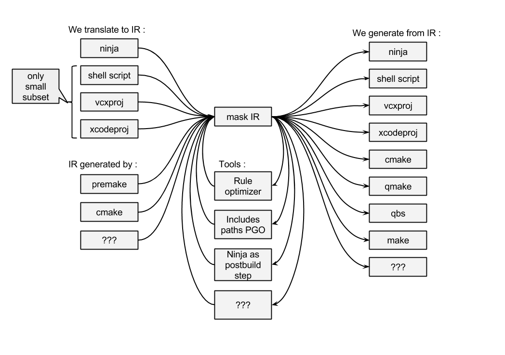

# Mask

Intermediate representation for build systems.

## Philosophy

There are "build systems" - they build dependency trees between sources and targets,
[some of them](https://martine.github.io/ninja/) are doing it really good.
There are also "project generators", they make decisions how and what to build,
they usually provide abstractions for packages, toolsets, etc.

Mask IR aims to be intermediate media between. Similar to ninja, all possible decisions should be made up front by mask generator.

## Infrastructure

## Goals

From [here](https://github.com/martine/ninja/blob/master/src/build_log_perftest.cc#L42-L61) we know :

	The average command length is 4.1 kB and there were 28674 commands in total,
	which makes for a total log size of ~120 MB (also counting output filenames).

Let's make some goals :

* (#1) Parsing and saving of mask IR file without need to reconstruct all data in memory in advance.
* (#2) Human readable format
* (#3) Easily generated from existing build systems
* (#4) Translate raw 120 MB shell script into compact IR format in less then 1 second on modern machine with SSD.
* (#5) Translate this compacted IR file into raw 120 MB shell script in less then 1 second on modern machine with SSD.

## Format

Format is based of ninja manifest format with some limitations which make it possible to achieve (#1) (#2) (#3)

* strict order of declaration :
	* variable definitions first
	* rules second
	* build command third
	* project commands last
* strict indentation rules : **??? TODO : could simplify parsing ???**
	* all lines, except for variables in rules, must contain no whitespace in the beginning
	* indent in rule and project variables is 2 spaces only
	* only one space is allowed between tokens
* no variable shadowing in build commands or rules, all variables are expanded immediately as they are encountered, with no exceptions
* only one variable reference syntax is allowed : ${name}, when syntax $name is not valid
* no "include" or "subninja", no variable scoping
* prefer implicit outputs to phony rule, but phony rule is still available
* no "default" keyword
* added "project" command
* build commands should be sorted by dependencies, meaning if we execute them from top to bottom everything should be valid
* order\_only\_dep is needed because in most cases some build steps can be placed in multiple locations (if two build steps are not related to each other then it doesn't matter in which order we execute them), mask is free to sort build steps as needed 

For example :

	# comment
	variable = ...

	rule rule_name
	  command = ...

	# build calls are sorted by dependencies
	build target: rule_name input

	build target | target2: rule_name input | implicit_input || order_only_dep

	# specify project and variations
	project test
	  debug = target1 target2 ...
	  any_other_variation_name = ...
